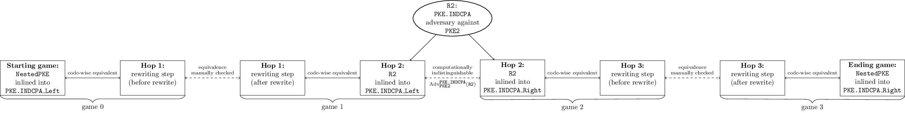
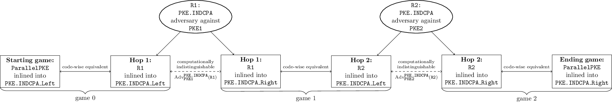
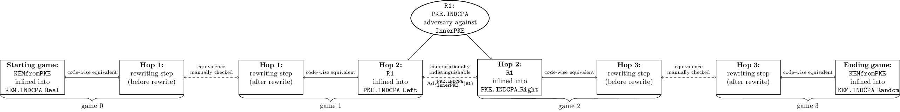
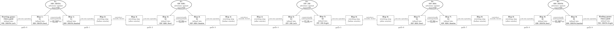

*WARNING: THIS FILE IS CURRENTLY OUT OF DATE; THE MAIN IDEAS ARE STILL HERE BUT SOME DETAILS MAY HAVE CHANGED*

# Examples

The `examples` directory contains several examples of constructions and corresponding proofs.

## List of Examples

- [nestedPKE](#nestedPKE): This is a public key encryption scheme where the message is encrypted under one PKE scheme, then that ciphertext is encrypted under a second PKE scheme; the resulting scheme is secure if either of the two PKE schemes is. This example actually contains two proofs of IND-CPA security.
	- The first proof assumes security of the inner PKE scheme. This proof is extremely simple and consists of a single game hop based on the indistinguishability of the inner PKE scheme. This is an example of an *indistinguishability proof step* and shows how to use a reduction to an indistinguishability property to relate two games.
	- The second proof assumes security of the outer PKE scheme. This proof introduces *rewriting proof steps*, which are needed to make use of certain facts known to the cryptographer but not encoded in the formalism (e.g., that two messages of the same length encrypt to two ciphertexts of the same length).
- [parallelPKE](#parallelPKE): A simple example involving a two-hop proof. This is a public key encryption scheme where the message is encrypted under two different public key encryption schemes and both ciphertexts are transmitted; hence both schemes must be secure for the overall scheme to be secure. The proof of IND-CPA security consists of two game hops each of which is an indistinguishability step involving a reduction to the IND-CPA security of one of the two public key encryption schemes.
- [KEMfromPKE](#KEMfromPKE): This is a key encapsulation mechanism built from public key encryption using "key transport": pick a random shared secret and encrypt it. Although there's only a single indistinguishability step (the IND-CPA security of the PKE) in the game hopping proof, the proof also requires two rewriting steps, again incorporating facts known to the cryptographer but not encoded in the formalism (that two randomly chosen shared secrets are the same length).
- [PKEfromKEM](#PKEfromKEM): This is a public key encryption scheme built by taking the KEM shared secret, applying a key derivation function to obtain a mask, and XORing the mask with the message.  This proof demonstrates the use of game hopping steps for each of the several different schemes (KEM, KDF) and also shows how to model security of XOR encryption with a one-time pad.  The proof is an example of a "forwards-and-backwards" proof, in which a sequence of hops replaces real values with random, then switches some value, then "undoes" the replacement of random values with real values. The starting and ending game are two sides of the same indistinguishability experiment.

### nestedPKE

`examples/nestedPKE/nestedPKE.py` contains an example of a public key encryption scheme which is constructed from two public key encryption schemes `pke1`, `pke2` by *nesting*: `ct = pke2.Encrypt(pk2, pke1.Encrypt(pk1, msg))`.

`examples/nestedPKE.py/nestedPKE.py_is_INDCPA.py` contains proofs that this PKE is IND-CPA-secure under the assumption that either of the two the public key encryption schemes `pke1`, `pke2` is IND-CPA-secure.  Note that this consists of two separate proofs, listed in the same file.

**Theorem.**
`nestedPKE` is an IND-CPA-secure public key encryption scheme, under the assumption that `pke1` is IND-CPA-secure.

**Proof.**
The proof consists of the following game hops:

- Starting game: `nestedPKE` inlined into the "left" version of the PKE IND-CPA game (`PKE.INDCPA.main0`), in which the challenge ciphertext is the encryption of `m0`.
- Ending game: `nestedPKE` inlined into the "right" version of the PKE IND-CPA game (`PKE.INDCPA.main1`), in which the challenge ciphertext is the encryption of `m1`.
	- The starting game and ending game are related via an indistinguishability step based on the IND-CPA security of scheme `pke1`. Reduction `R1` is an IND-CPA adversary against scheme `pke1`. It uses the `pke1` IND-CPA challenger to encrypt either `m0` or `m1` and then encrypts the resulting ciphertext using scheme `pke2`.

**Theorem.**
`nestedPKE` is an IND-CPA-secure public key encryption scheme, under the assumption that `pke2` is IND-CPA-secure.

**Proof.**
The proof consists of the following game hops:

- Starting game: `nestedPKE` inlined into the "left" version of the PKE IND-CPA game (`PKE.INDCPA.main0`), in which the challenge ciphertext is the encryption of `m0`.
- Game 1: A rewrite of the starting game, which uses the fact that `len(pke1.Encrypt(pk1, m0)) = len(pke1.Encrypt(pk1, m1))` assuming `len(m0) == len(m1)`.
	- The starting game and game 1 are related via a rewriting step, the validity of which must be manually checked via the diff output by the proof engine.
- Game 2: The challenge ciphertext is switched to be the encryption of `m1`.
	- Game 1 and game 2 are related via an indistinguishability step based on the IND-CPA security of scheme `pke2`. Reduction `R2` is an IND-CPA adversary against scheme `pke1`. It encrypts `m0` and `m1` under `pke1` itself, then passes the two resulting ciphertexts to the IND-CPA challenge for `pke2`.
- Game 3: A rewrite of game 2, which again uses the fact that `len(pke1.Encrypt(pk1, m0)) = len(pke1.Encrypt(pk1, m1))` assuming `len(m0) == len(m1)`. 
	- Game 2 and game 3 are related via a rewriting step, the validity of which must be manually checked via the diff output by the proof engine.
- Game 3 is equivalent to the ending game: `nestedPKE` inlined into the "right" version of the PKE IND-CPA game (`PKE.INDCPA.main1`), in which the challenge ciphertext is the encryption of `m1`.

### parallelPKE

`examples/parallelPKE/parallelPKE.py` contains an example of a public key encryption scheme which is constructed from two public key encryption schemes `pke1`, `pke2` by *side-by-side encryption*: `ct = pke1.Encrypt(pk1, msg) ||  pke2.Encrypt(pk2, msg)`.

`examples/parallelPKE/parallelPKE_is_INDCPA.py` contains a proof of the following:

**Theorem.**
`parallelPKE` is an IND-CPA-secure public key encryption scheme, under the assumption that both `pke1` and `pke2` are IND-CPA-secure.

**Proof.**
The proof consists of the following game hops:

- Starting game: `parallelPKE` inlined into the "left" version of the PKE IND-CPA game (`PKE.INDCPA.main0`), in which both components of the challenge ciphertext are the encryption of `m0`.
- Game 1: The first component of the challenge ciphertext is switched to be the encryption of `m1`.
	- The starting game and game 1 are related via an indistinguishability step based on the IND-CPA security of scheme `pke1`. Reduction `R01` is an IND-CPA adversary against scheme `pke1`. It uses its `pke1` IND-CPA challenger to encrypt `m0` or `m1` for the first ciphertext component, and encrypts `m0` under `pke2` itself for the second ciphertext component.
- Game 2: The second component of the challenge ciphertext is switched to be the encryption of `m1`.
	- Game 1 and game 2 are related via an indistinguishability step based on the IND-CPA security of scheme `pke2`. Reduction `R12` is an IND-CPA adversary against scheme `pke2`. It encrypts `m1` under `pke1` itself for the first ciphertext component, and uses its `pke2` IND-CPA challenger to encrypt `m0` or `m1` for the second ciphertext component.
- Game 2 is equivalent to the ending game: `parallelPKE` inlined into the "right" version of the PKE IND-CPA game (`PKE.INDCPA.main1`), in which both components of the challenge ciphertext are the encryption of `m1`.

### KEMfromPKE

`examples/KEMfromPKE/KEMfromPKE.py` contains an example in which a key encapsulation mechanism is generically constructed from a public key encryption scheme by having the encapsulator pick a random shared secret and transport it to the decapsulator via public key encryption:

1. `ss <- UniformlyRandom(SharedSecret)`
2. `ct <- pke.Encrypt(pk, ss)`

`examples/KEMfromPKE/KEMfromPKE_is_INDCPA.py` contains a proof of the following:

**Theorem.**
`KEMfromPKE` is an IND-CPA-secure key encapsulation mechanism under the assumption that `pke` is an IND-CPA-secure public key encryption scheme.

**Proof.**
The proof consists of the following game hops:

- Starting game: `KEMfromPKE` inlined into the "real" version of the KEM IND-CPA game (`KEM.INDCPA.main0`), where the adversary is challenged with the real shared secret encapsulated in the challenge ciphertext.
- Game 1: A rewrite of the starting game, which uses the fact that two shared secrets selected uniformly at random have the same length.
	- The starting game and game 1 are related via a rewriting step, the validity of which must be manually checked via the diff output by the proof engine.
- Game 2: The shared secret that the adversary is challenged with is changed to be the random value.
	- Game 1 and game 2 are related via an indistinguishability step based on the IND-CPA security of scheme `pke`. Reduction `R12` is an IND-CPA adversary against scheme `pke`. It selects two shared secrets and has its IND-CPA challenger for `pke` encrypt one of them.
- Game 3: A rewrite of game 2, which again uses the fact that two shared secrets selected uniformly at random have the same length.	- Game 2 and game 3 are related via a rewriting step, the validity of which must be manually checked via the diff output by the proof engine.
- Game 3 is equivalent to the ending game: `KEMfromPKE ` inlined into the "random" version of the KEM IND-CPA game (`KEM.INDCPA.main1`), where the adversary is challenged with a random shared secret rather than the real shared secret encapsulated in the challenge ciphertext.

### PKEfromKEM

`examples/PKEfromKEM/PKEfromKEM ` contains an example in which a public key encryption scheme is generically constructed from a key encapsulation mechanism by having taking the shared secret from the encapsulation, applying a key derivation function to construct a mask, and XORing the mask with the message:

1. `(ct1, ss) = kem.Encaps(pk)`
2. `mask = kdf.KDF(ss, "label", len(msg))`
3. `ct2 = mask ^ msg`
4. `return (ct1, ct2)`

`examples/PKEfromKEM/PKEfromKEM_is_INDCPA.py ` contains a proof of the following:

**Theorem.**
`PKEfromKEM` is an IND-CPA-secure public key encryption scheme under the assumption that `kem` is an IND-CPA-secure KEM and `kdf` is a secure key derivation function.

**Proof.** 
The proof is a "forwards-and-backwards" proof, in which we start with the "left" version of the PKE IND-CPA game in which the challenge ciphertext encrypts `m0`, replace all the relevant values with random, swap to encrypting `m1`, and then "undo" the replacements switching all random values back to real, yielding the "right" version of the PKE IND-CPA game in which the challenge cipheretxt encrypts `m1`.

The proof consists of the following game hops:

- Starting game: `PKEfromKEM` inlined into the "left" version of the PKE IND-CPA game (`PKE.INDCPA.main0`), in which the challenge ciphertext is the encryption of `m0`.
- Game 1: In constructing the challenge ciphertext, a random value is used in place of the KEM shared secret.
	- The starting game and game 1 are related via an indistinguishability step based on the IND-CPA security of KEM scheme `kem`. Reduction `R01` is an IND-CPA adversary against scheme `kem`. It receives a KEM challenge public key, ciphertext, and shared secret from its KEM IND-CPA challenge for `kem`, and uses this to encrypt `m0`.
- Game 2: In constructing the challenge ciphertext, a random value is used in place of the output of the key derivation function.
	- Game 1 and game 2 are related via an indistinguishability step based on the security of the key derivation function `kdf`. Reduction `R12` is an adversary against scheme `kdf`. It uses its KDF challenger to get the mask used to encrypt `m0`.
- Game 3: In constructing the challenge ciphertext, `m1` is used rather than `m0`.
	- Game 2 and game 3 are related via an indistinguishability step based on the security of XOR as a one-time pad.  Reduction `R23` is an adversary against the indistinguishability of the one-time pad. It uses its one-time pad encryption challenger to get the encryption of either `m0` or `m1`. (The reader might wonder why a "reduction" is necessary here, since the one-time pad is information-theoretic rather than computational. In the pygamehop framework, every game transition is connected via a reduction, since the proof engine must be told how to connect two games via the distinguishing of some security property.)
- (We now start "undoing" the replacements as mentioned above.)
- Game 4: In constructing the challenge ciphertext, the real output of the key derivation function is used rather than a random value.
	- Game 3 and game 4 are related via an indistinguishability step based on the security of the key derivation function `kdf`. Reduction `R34` is an adversary against scheme `kdf`. It uses its KDF challenger to get the mask used to encrypt `m1`.
- Game 5: In constructing the challenge ciphertext, the real KEM shared secret is used rather than a random value.
	- Game 4 and game 5 are related via an indistinguishability step based on the IND-CPA security of KEM scheme `kem`. Reduction `R45` is an IND-CPA adversary against scheme `kem`. It receives a KEM challenge public key, ciphertext, and shared secret from its KEM IND-CPA challenge for `kem`, and uses this to encrypt `m1`.
- Game 5 is equivalent to the ending game: `PKEfromKEM` inlined into the "right" version of the PKE IND-CPA game (`PKE.INDCPA.main1`), in which the challenge ciphertext is the encryption of `m1`.
